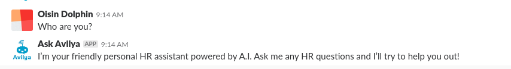

# Slack Demo Bot Readme #

Slack demo HR bot that uses open source natural language tools (rasa core and rasa nlu).
The application uses a micro-service architecture with docker-compose.

### Local Setup ###

* Install Docker [Docker Download](https://www.docker.com/get-docker)
* Install Docker-Compose [Docker-Compose Download](https://docs.docker.com/compose/install/)
* Add a bot to your slack channel and locate your bot secrets [Slack Bot Guide](https://api.slack.com/bot-users)
* Create a file called `secrets_development.env` and paste in your lack secrets in the
    format of `secrets_example.env`
* run `make development_build` in your terminal 
* test out your new bot in slack

### Run Tests ###
* run `make test` in your terminal  

### Running in Production ###
* Set up your server with docker and docker-compose
* Create a new production bot and locate slack secrets
* Create a `secrets_production.env` file with the new secrets
* run `make production_build` from the server terminal 

